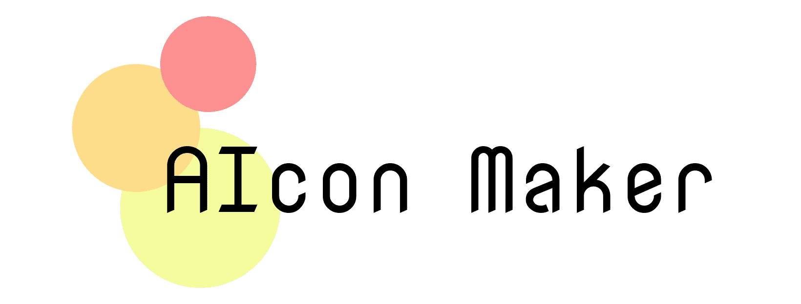

# AIcon Maker

## 製品概要
### 背景(製品開発のきっかけ、課題等）
オンラインでの共同作業をする機会が増え、SNS、共同作業プラットフォーム、オンライン会議(Slack, twitter, Zoomなど)でアイコンの重要性が高まっています。しかし、自分の好きなアイコンを選んだり作成したりすることに苦労する人も多いと思います。「おしゃれな雰囲気のアイコンがいい」や「猫をモチーフにしたアイコンがいい」という抽象的な希望を持っている人もいれば、「とりあえずなんでもいいから自分に合ったアイコンが欲しい」という方もいらっしゃると思います。しかし、これまでのアイコン生成アプリはアバターの髪型を変更するなど、抽象的な希望を自由に叶える柔軟性がありませんでした。本ウェブアプリはこの２つのニーズに応えるため、AI（Stable diffusion）を用いてユーザーに合ったアイコンを生成します。
### 製品説明（具体的な製品の説明）
本ウェブアプリはスマホ、PCの両方から利用でき、大きく分けて以下の２つの機能を持ちます。
* 雰囲気やモチーフのタグを選択したり、自分で入力することで、タグに合ったアイコンを出力します。
* 心理テストを受けることで、ユーザーの性格に合ったアイコンを出力します。

生成されたアイコンはアプリ上でダウンロードできたり、主要なSNS(LINE, facebook, twitter)で共有することができます。

#### 生成例

### 特長
#### 1. 特長1: 操作しやすいUI
#### 2. 特長2: 質の高いアイコンを作成するためのプロンプト生成機
#### 3. 特長3: チーム開発しやすいモジュールわけ

### 解決出来ること
「おしゃれな雰囲気のアイコンがいい」や「猫をモチーフにしたアイコンがいい」という抽象的な希望や、「とりあえずなんでもいいから自分に合ったアイコンが欲しい」といったニーズに柔軟に対応できる。

### 今後の展望
* 強力なGPUを複数台利用することで、現在各ユーザーにとって生成に40秒ほどかかっているところを、待ち時間短縮ができる
* 画風など、指定できるタグを増やすとより自由度が増す
* 生成された画像を編集（手動または「もっとこうして」とテキスト入力すると再度AIで生成）できるようにすると、さらにユーザーの希望に合ったアイコンが生成できるようになる

### 注力したこと（こだわり等）
* レスポンシブデザインを行い、スマホでもPCでも操作しやすいUIを実現した。
* gooラボAPIのテキストペア類似度を用いて、人間にわかりやすいタグのみから、Stable Diffusionが良いアイコンを生成できるようなプロンプトを作成するモジュールを開発した。
* 忙しい６人のメンバーで効率よく実装ができるようにフロントエンド、バックエンド、GPUサーバーなど、モジュール分けを工夫した。
* Stable Diffusionのモデルを読み込む時間を節約し、より素早く生成結果を出せるように実装し、自前のGPU（RTX 3070）で生成結果を返せるようにした。
* 多くの人が同時にアクセスしても問題ないようにジョブをバックエンドで管理し、待ち人数を表示できるようにした。

## 開発技術
### 活用した技術
#### API・データ
* gooラボAPI
* Stable Diffusion
* google翻訳API

#### フレームワーク・ライブラリ・モジュール
* TypeScript
* NEXT.js
* tailwindcss
* Vercel
* Django
* HEROKU
* SQLite
* PyTorch

### 独自技術
#### ハッカソンで開発した独自機能・技術
* 操作しやすいUI　(frontend/src/)
* 質の高いアイコンを作成するためのプロンプト生成機 (aicon_maker_backend/aiconapi/prompt.py)

#### 製品に取り入れた研究内容（データ・ソフトウェアなど）（※アカデミック部門の場合のみ提出必須）
* Stable Diffusion
